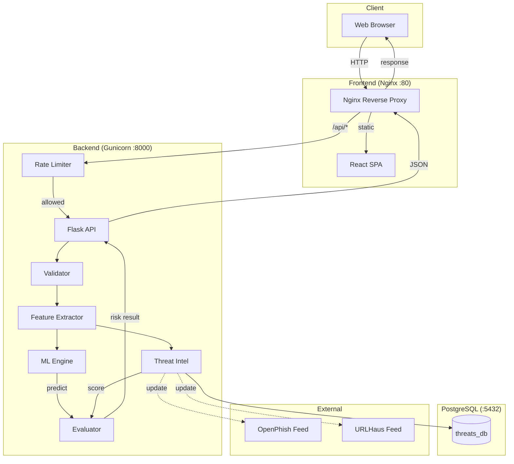

# Smart Phishing Detection & URL Risk Analyzer

A production-ready web application that analyzes URLs and evaluates phishing risk using **Random Forest ML (99.46% accuracy)** and **threat intelligence feeds** (OpenPhish + URLHaus).

---

## Project Structure

```
phishing-detection/
├── docker-compose.yml          # 3-service orchestration
├── .env                        # Environment variables
├── .env.example                # Environment template
├── .gitignore
├── README.md                   # This file
├── prepare_data.py             # Dataset generation & splitting script
│
├── frontend/
│   ├── Dockerfile              # Multi-stage: Node → Nginx
│   ├── nginx.conf              # Reverse proxy config
│   ├── package.json
│   ├── vite.config.js
│   ├── tailwind.config.js
│   ├── postcss.config.js
│   ├── index.html
│   ├── README.md               # Frontend module docs
│   └── src/
│       ├── main.jsx
│       ├── App.jsx             # Main UI with risk gauge + indicator bar
│       ├── api/index.js        # API client
│       └── styles/index.css
│
├── backend/
│   ├── Dockerfile              # Python slim + Gunicorn
│   ├── app.py                  # Flask entry point
│   ├── requirements.txt
│   ├── init_db.sql             # PostgreSQL initialization script
│   ├── README.md               # Backend module docs
│   ├── services/
│   │   ├── validator.py        # URL validation & standardization
│   │   ├── feature_extractor.py # 24-feature URL extraction
│   │   ├── threat_intel.py     # PostgreSQL threat intel lookup
│   │   ├── update_threat_db.py # Standalone feed update script
│   │   ├── rate_limiter.py     # Sliding window rate limiter
│   │   ├── ml_engine.py        # Random Forest model loader
│   │   └── evaluator.py        # Risk scoring (ML 40% + Threat 60%)
│   ├── models/
│   │   ├── rf_model.pkl        # Trained Random Forest
│   │   ├── feature_cols.pkl    # Feature column order
│   │   └── model_training.ipynb # Training notebook
│   └── data/
│       ├── original_dataset.csv # Original dataset
│       ├── generated_dataset.csv # Extracted features
│       ├── train.csv            # 70% training data
│       ├── val.csv              # 15% validation data
│       ├── test.csv             # 15% test data (with URL column)
│       └── Final_Testing.csv    # Test set (URL + label only)
```

---

## System Flow



---

## Project Overview

| Component | Technology | Description |
|---|---|---|
| **Frontend** | React + Vite + Tailwind | Single-page app with risk gauge, indicator bar, feature table |
| **Backend** | Flask + Gunicorn (4 workers) | REST API with URL validation, feature extraction, ML prediction |
| **Database** | PostgreSQL 16 | Threat intelligence storage (26K+ malicious domains) |
| **ML Model** | Random Forest (200 estimators) | 24 URL-based features, 99.46% accuracy |
| **Threat Intel** | OpenPhish + URLHaus | Standalone update script, domain-only storage |
| **Rate Limiter** | Sliding window (file-based) | 10 requests per 60 seconds per IP |

### Scoring System

| Component | Weight | Description |
|---|---|---|
| **ML Score** | 40% | Random Forest prediction confidence |
| **Threat Intel** | 60% | 0 (clean) or 100 (found in feed) |

**Formula:** `Final Score = (ML × 0.4) + (Threat × 0.6)`

| Score Range | Tag | Meaning |
|---|---|---|
| 0–25 | **Safe** | Clean URL, no threats detected |
| 26–50 | **Suspicious** | Some concerning patterns |
| 51–75 | **Warning** | High phishing likelihood |
| 76–100 | **Risky** | Confirmed threat or extremely dangerous |

**Exception:** If threat intel found → Tag is ALWAYS "Risky"

---

## Deployment

### Prerequisites

- Docker 20.10+
- Docker Compose 2.0+

### Standard Ports

| Service | Container Port | Host Port | Purpose |
|---|---|---|---|
| **Frontend** | 80 | **80** | Web UI (Nginx) |
| **Backend** | 8000 | **7777** | Flask API (Gunicorn) |
| **PostgreSQL** | 5432 | **5433** | Threat Intel DB |

### Step 1: Deploy

```bash
cd phishing-detection
docker compose up -d --build
```

### Step 2: Verify

```bash
docker compose ps
```

Expected output:
```
NAME                STATUS                    PORTS
phishing-backend    Up (healthy)              0.0.0.0:7777->8000/tcp
phishing-db         Up (healthy)              0.0.0.0:5433->5432/tcp
phishing-frontend   Up                        0.0.0.0:80->80/tcp
```

### Step 3: Populate Threat Database

```bash
docker compose exec backend python services/update_threat_db.py
```

### Step 4: Access

| Service | URL |
|---|---|
| Frontend (Web UI) | http://localhost |
| Backend API | http://localhost:7777/api/health |
| PostgreSQL (PgAdmin 4) | localhost:5433 |

### Environment Variables

File: `.env`

```env
DB_NAME=threats_db
DB_USER=threddb
DB_PASS=12345
```

### Docker Commands

```bash
# Start
docker compose up -d --build

# View logs
docker compose logs -f backend

# Stop
docker compose down

# Stop & remove volumes
docker compose down -v

# Restart single service
docker compose restart backend
```

### Update Threat Intelligence

```bash
# From host
python backend/services/update_threat_db.py

# Inside container
docker compose exec backend python services/update_threat_db.py
```

### Retrain ML Model

```bash
# 1. Generate dataset
python prepare_data.py

# 2. Run training notebook
cd backend/models
jupyter nbconvert --to notebook --execute model_training.ipynb --output model_training.ipynb

# 3. Restart backend
docker compose restart backend
```

### PgAdmin 4 Connection

| Field | Value |
|---|---|
| **Host** | `localhost` |
| **Port** | `5433` |
| **Maintenance database** | `postgres` |
| **Username** | `threddb` |
| **Password** | `12345` |

After connecting: **threats_db → Schemas → public → Tables → malicious_domains**
# Phishing_Detection_-URL_Risk_Analyzer
