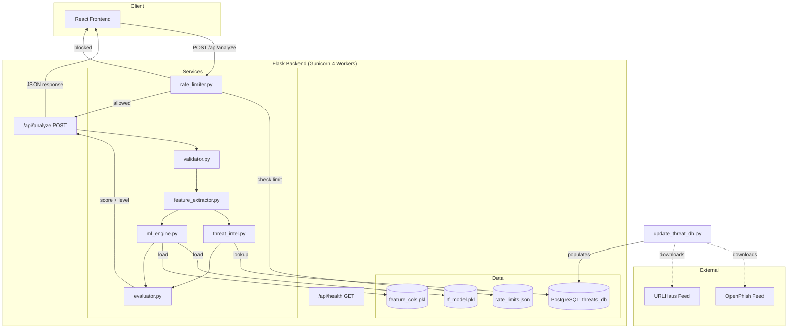
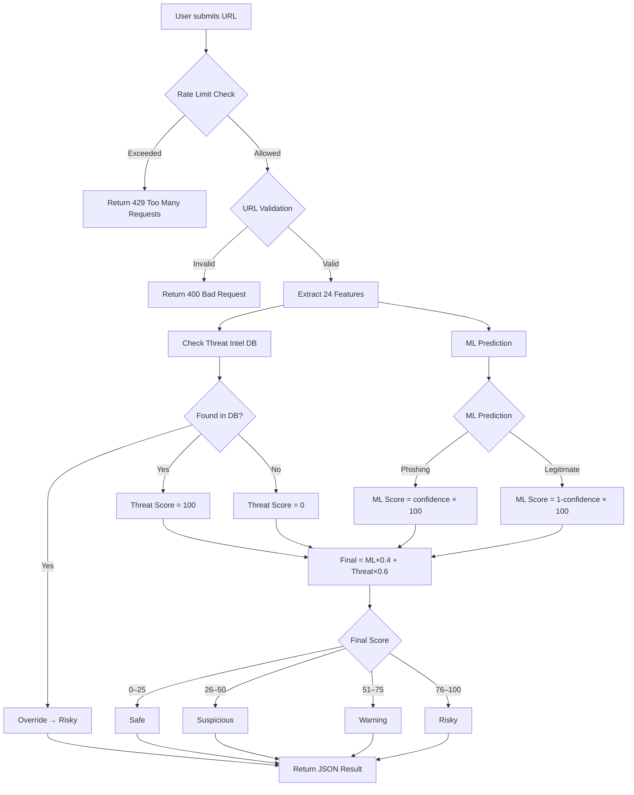
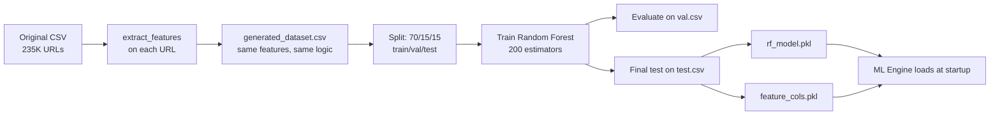

# Backend Documentation

Flask-based backend for Smart Phishing Detection & URL Risk Analyzer. Uses Random Forest ML (99.46% accuracy), PostgreSQL threat intelligence, and rate limiting for production-ready URL risk analysis.

---

## System Architecture



---

## Request Flow



---

## Module Documentation

### 1. Rate Limiter (`services/rate_limiter.py`)

Protects API from abuse using sliding window algorithm with file-based storage for multi-worker compatibility.

**Configuration:**
- **Max Requests:** 10 per 60 seconds per IP
- **Storage:** `data/rate_limits.json` (file-based, shared across workers)
- **Locking:** `fcntl` file locks for thread safety

**Methods:**
| Method | Input | Output | Description |
|---|---|---|---|
| `is_allowed(client_id)` | IP address string | bool | Checks if request is within limit |
| `remaining(client_id)` | IP address string | int | Returns remaining requests in window |
| `reset_time(client_id)` | IP address string | float | Returns seconds until window resets |

**Response Headers:**
```
X-RateLimit-Limit: 10
X-RateLimit-Remaining: 7
X-RateLimit-Reset: 1775285978
```

**429 Response:**
```json
{
  "error": "Rate limit exceeded. Try again later.",
  "retry_after": 42
}
```

---

### 2. Validator (`services/validator.py`)

Validates and standardizes URL input before processing.

**Responsibilities:**
- Enforces `http://` or `https://` protocol requirement
- Validates domain format (hostname or IP address)
- Auto-adds `www.` prefix if missing (non-IP domains)
- Preserves original scheme (`http` or `https`)
- Preserves path, query, and fragment components

**Functions:**
| Function | Input | Output | Description |
|---|---|---|---|
| `validate_url(url)` | raw URL string | `(standardized_url, error)` | Validates and standardizes URL |
| `extract_domain(url)` | validated URL | domain string | Extracts domain (e.g., `www.google.com`) |

**Validation Rules:**
- Must start with `http://` or `https://`
- Domain must match hostname pattern or IPv4 pattern
- Non-IP domains get `www.` prefix added
- Original scheme is preserved (not forced to HTTPS)

---

### 3. Feature Extractor (`services/feature_extractor.py`)

Converts a URL into a 24-dimensional numerical feature vector. Features are derived entirely from the URL string — no external lookups.

**Output Features (24 total):**

| Feature | Type | Description |
|---|---|---|
| `URLLength` | int | Total character count of URL |
| `DomainLength` | int | Length of domain excluding TLD |
| `IsDomainIP` | 0/1 | Whether domain is an IP address |
| `TLDLength` | int | Length of top-level domain |
| `NoOfSubDomain` | int | Count of subdomains (excluding www) |
| `NoOfLettersInURL` | int | Count of alphabetic characters |
| `LetterRatioInURL` | float | Letters / total URL length |
| `NoOfDigitsInURL` | int | Count of numeric characters |
| `DigitRatioInURL` | float | Digits / total URL length |
| `NoOfEqualsInURL` | int | Count of `=` characters |
| `NoOfQMarkInURL` | int | Count of `?` characters |
| `NoOfAmpersandInURL` | int | Count of `&` characters |
| `NoOfOtherSpecialCharsInURL` | int | Count of special characters |
| `SpecialCharRatioInURL` | float | Special chars / total URL length |
| `HasObfuscation` | 0/1 | Whether domain contains obfuscation chars |
| `NoOfObfuscatedChar` | int | Count of obfuscation chars in domain |
| `ObfuscationRatio` | float | Obfuscated chars / domain length |
| `IsHTTPS` | 0/1 | Whether URL uses HTTPS |
| `Bank` | 0/1 | Contains bank-related keywords |
| `Pay` | 0/1 | Contains "pay" keyword |
| `Crypto` | 0/1 | Contains crypto-related keywords |
| `SuspiciousWords` | int | Count of suspicious keywords found |
| `URLDepth` | int | Number of path segments |
| `AvgTokenLength` | float | Average length of URL tokens |

**Obfuscation Characters:** `@`, `0`, `1`, `!`, `|`

**Suspicious Keywords:** `login`, `signin`, `secure`, `account`, `verify`, `update`, `confirm`, `banking`, `password`, `credential`, `authenticate`, `authorize`, `ebayisapi`, `webscr`, `cmd`, `wallet`, `transfer`, `phishing`, `hack`, `steal`, `fake`, `scam`

---

### 4. Threat Intelligence (`services/threat_intel.py`)

Checks URLs against known malicious domain databases stored in PostgreSQL.

**Data Sources:**
- **OpenPhish** — `https://openphish.com/feed.txt`
- **URLHaus** — `https://urlhaus.abuse.ch/downloads/text/`

**Storage:** PostgreSQL database `threats_db`, table `malicious_domains`

**Connection Pool:** `SimpleConnectionPool` (min: 2, max: 20 connections)

**Functions:**
| Function | Description |
|---|---|
| `init_db()` | Creates table and index if not exists |
| `check_threat_intel(domain)` | Queries PostgreSQL for domain matches |

**Database Schema:**
```sql
CREATE TABLE malicious_domains (
    domain TEXT PRIMARY KEY,
    sources TEXT NOT NULL,
    added_at TEXT NOT NULL,
    updated_at TEXT NOT NULL
);
CREATE INDEX idx_domain ON malicious_domains(domain);
```

**Domain Lookup:** Checks both `domain` and `www.domain` variants for comprehensive matching.

**Update Script:** `services/update_threat_db.py` — standalone script that downloads feeds, extracts unique domains, and populates PostgreSQL. Run manually or via cron.

---

### 5. ML Engine (`services/ml_engine.py`)

Loads and serves the trained Random Forest model for phishing prediction.

**Model Details:**
- Algorithm: Random Forest Classifier
- Estimators: 200
- Max Depth: 20
- Class Weight: balanced
- Training Data: 235,837 URLs
- Accuracy: **99.46%**

**Functions:**
| Function | Input | Output | Description |
|---|---|---|---|
| `_load_model()` | — | — | Loads `rf_model.pkl` and `feature_cols.pkl` |
| `predict(features)` | feature dict | `(prediction, confidence)` | Returns label (0/1) and confidence score |

**Model Files:**
- `models/rf_model.pkl` — serialized Random Forest model
- `models/feature_cols.pkl` — ordered list of 24 feature column names

---

### 6. Evaluator (`services/evaluator.py`)

Combines ML prediction and threat intelligence into a final risk score (0–100) and risk level.

**Scoring Logic:**

| Component | Weight | Score Calculation |
|---|---|---|
| **ML Score** | 40% | Phishing: `confidence × 100` / Legitimate: `(1 - confidence) × 100` |
| **Threat Intel** | 60% | Found: `100` / Not found: `0` |

**Formula:** `Final Score = (ML_Score × 0.4) + (Threat_Score × 0.6)`

**Risk Tags:**
| Score Range | Tag |
|---|---|
| 0–25 | **Safe** |
| 26–50 | **Suspicious** |
| 51–75 | **Warning** |
| 76–100 | **Risky** |

**Exception Rule:** If threat intel found → Tag is ALWAYS "Risky" (overrides score)

---

## API Endpoints

### POST `/api/analyze`

Analyze a URL for phishing risk.

**Request Body:**
```json
{
  "url": "https://www.example.com"
}
```

**Response (200):**
```json
{
  "url": "https://www.example.com",
  "domain": "www.example.com",
  "features": { "URLLength": 23, "DomainLength": 11, ... },
  "threat_intel": { "found": false, "sources": [] },
  "ml_prediction": "legitimate",
  "ml_confidence": 0.9823,
  "risk_score": 7.51,
  "risk_level": "Safe",
  "breakdown": {
    "ml_score": 1.77,
    "threat_score": 0
  }
}
```

**Response (429 - Rate Limited):**
```json
{
  "error": "Rate limit exceeded. Try again later.",
  "retry_after": 42
}
```

### GET `/api/health`

Check server and model status.

**Response:**
```json
{
  "status": "ok",
  "model_loaded": true
}
```

---

## Project Structure

```
backend/
├── app.py                      # Flask entry point, routes, rate limiter integration
├── requirements.txt            # Python dependencies
├── init_db.sql                 # PostgreSQL table initialization
├── Dockerfile                  # Python slim + Gunicorn
├── .dockerignore
├── README.md                   # This file
├── services/
│   ├── __init__.py
│   ├── rate_limiter.py         # Sliding window rate limiter (file-based)
│   ├── validator.py            # URL validation & standardization
│   ├── feature_extractor.py    # 24-feature URL extraction
│   ├── threat_intel.py         # PostgreSQL threat intel lookup
│   ├── update_threat_db.py     # Standalone feed update script
│   ├── ml_engine.py            # Random Forest model loader
│   └── evaluator.py            # Risk scoring (ML 40% + Threat 60%)
├── models/
│   ├── rf_model.pkl            # Trained Random Forest model
│   ├── feature_cols.pkl        # Feature column order
│   └── model_training.ipynb    # Complete training notebook
└── data/
    ├── original_dataset.csv    # Original dataset
    ├── generated_dataset.csv   # Extracted features
    ├── train.csv               # 70% training data
    ├── val.csv                 # 15% validation data
    ├── test.csv                # 15% test data (with URL column)
    └── Final_Testing.csv       # Test set (URL + label only)
```

---

## Setup

```bash
# Install dependencies
pip install -r requirements.txt

# Run server
python app.py
```

Server runs on `http://localhost:7777`.

---

## ML Training Pipeline



**Key Design Decision:** The feature extractor used at inference time is the **exact same code** used to generate the training dataset. This guarantees zero feature mismatch between training and prediction.
