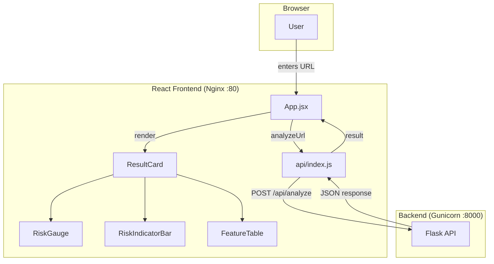
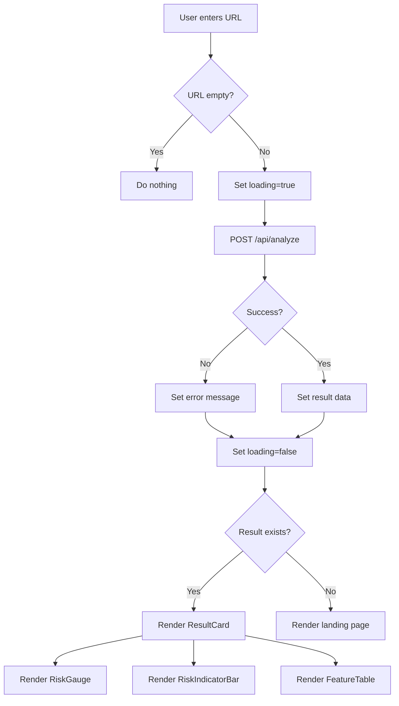

# Frontend Documentation

React + Vite + Tailwind CSS single-page application for Smart Phishing Detection & URL Risk Analyzer.

---

## System Architecture



---

## Request Flow



---

## Component Structure

```
src/
├── main.jsx              # React entry point
├── App.jsx               # Root component with all UI logic
├── api/
│   └── index.js          # API client functions
└── styles/
    └── index.css         # Tailwind imports
```

---

## Module Documentation

### 1. App (`App.jsx`)

Root component managing application state, form handling, and conditional rendering.

**State:**
| State | Type | Default | Description |
|---|---|---|---|
| `url` | string | `''` | User input URL |
| `result` | object | `null` | Analysis response from backend |
| `loading` | boolean | `false` | Loading state during API call |
| `error` | string | `null` | Error message display |

**Flow:**
1. User enters URL in input field
2. Form submits to `analyzeUrl()` from API layer
3. Sets `loading=true`, clears previous results and errors
4. On success: sets `result` with full analysis data
5. On failure: sets `error` message
6. `ResultCard` renders when `result` exists
7. Landing page renders when no result

**Conditional Rendering:**
| Condition | Rendered |
|---|---|
| `result` exists | `ResultCard` with gauge, indicator bar, feature table |
| `error` exists | Error alert banner |
| `loading` true | "Analyzing..." button text |
| None of above | Landing page with feature stats |

---

### 2. RiskGauge

SVG circular gauge displaying the risk score (0–100).

**Props:**
| Prop | Type | Description |
|---|---|---|
| `score` | number | Risk score 0–100 |

**Visual Logic:**
| Score Range | Color |
|---|---|
| 0–25 | Green (`#22c55e`) |
| 26–50 | Yellow (`#eab308`) |
| 51–75 | Orange (`#f97316`) |
| 76–100 | Red (`#ef4444`) |

**Implementation:** Uses SVG `stroke-dasharray` and `stroke-dashoffset` on a circle to create an animated arc proportional to the score. Score value displayed in center.

---

### 3. RiskIndicatorBar

Horizontal bar showing all 4 risk tags in increasing order with a marker showing exact score position.

**Props:**
| Prop | Type | Description |
|---|---|---|
| `score` | number | Risk score 0–100 |

**Segments:**
| Segment | Range | Color | Inactive Color |
|---|---|---|---|
| Safe | 0–25 | `#22c55e` | `#dcfce7` |
| Suspicious | 26–50 | `#eab308` | `#fef9c3` |
| Warning | 51–75 | `#f97316` | `#ffedd5` |
| Risky | 76–100 | `#ef4444` | `#fee2e2` |

**Visual Elements:**
- 4 colored segments (light background for inactive, full color for active)
- Dark marker line showing exact score position
- Tag labels above each segment (active tag bold + colored)
- Score range below each segment
- Score value and active tag badge at bottom

---

### 4. ResultCard

Displays the complete analysis result with all components.

**Props:**
| Prop | Type | Description |
|---|---|---|
| `result` | object | Full API response object |

**Renders:**
- RiskGauge (circular score display)
- URL and domain information
- ML prediction and confidence
- Threat intel status with source names
- Score breakdown (ML score + Threat score)
- RiskIndicatorBar (horizontal risk level bar)
- FeatureTable (24 extracted features grid)

---

### 5. FeatureTable

Grid display of all 24 extracted URL features with human-readable labels.

**Props:**
| Prop | Type | Description |
|---|---|---|
| `features` | object | 24 key-value feature pairs |

**Layout:** Responsive grid — 2 columns on mobile, 3 on tablet, 4 on desktop.

**Feature Labels:**
| Key | Display Label | Key | Display Label |
|---|---|---|---|
| `URLLength` | URL Length | `NoOfQMarkInURL` | Question Marks |
| `DomainLength` | Domain Length | `NoOfAmpersandInURL` | Ampersands |
| `IsDomainIP` | Domain is IP | `NoOfOtherSpecialCharsInURL` | Special Chars |
| `TLDLength` | TLD Length | `SpecialCharRatioInURL` | Special Char Ratio |
| `NoOfSubDomain` | Subdomains Count | `HasObfuscation` | Has Obfuscation |
| `NoOfLettersInURL` | Letters in URL | `NoOfObfuscatedChar` | Obfuscated Chars |
| `LetterRatioInURL` | Letter Ratio | `ObfuscationRatio` | Obfuscation Ratio |
| `NoOfDigitsInURL` | Digits in URL | `IsHTTPS` | Uses HTTPS |
| `DigitRatioInURL` | Digit Ratio | `Bank` | Bank Keywords |
| `NoOfEqualsInURL` | Equals Signs | `Pay` | Pay Keywords |
| `Crypto` | Crypto Keywords | `URLDepth` | URL Depth |
| `SuspiciousWords` | Suspicious Words | `AvgTokenLength` | Avg Token Length |

---

### 6. API Client (`api/index.js`)

HTTP client for backend communication.

**Configuration:**
```javascript
const API_BASE = import.meta.env.VITE_API_URL || 'http://localhost:7777'
```

**Functions:**
| Function | Method | Endpoint | Returns |
|---|---|---|---|
| `analyzeUrl(url)` | POST | `/api/analyze` | Full analysis result |
| `checkHealth()` | GET | `/api/health` | Server status |

**Error Handling:** Throws error with message from backend response on non-200 status.

---

## Build & Run

### Development
```bash
npm install
npm run dev
```
Server runs on `http://localhost:3000` (or next available port) with Vite HMR.

### Production Build
```bash
npm run build
```
Outputs optimized static files to `dist/`.

### Preview Production Build
```bash
npm run preview
```

---

## Styling

Uses **Tailwind CSS** via PostCSS. All styling is utility-class based in JSX — no separate CSS files beyond the Tailwind imports.

**Color Scheme:**
- Background: `slate-900` → `blue-900` gradient
- Cards: White with shadow
- Text: White on dark, gray on white cards
- Risk colors: Green (Safe), Yellow (Suspicious), Orange (Warning), Red (Risky)

---

## Deployment

The frontend is containerized with a **multi-stage Docker build**:

1. **Stage 1** (`node:20-alpine`): Install deps, run `npm run build`
2. **Stage 2** (`nginx:alpine`): Serve `dist/` via Nginx

**Nginx config** (`nginx.conf`):
- Serves static files from `/usr/share/nginx/html`
- Proxies `/api/*` requests to `http://backend:8000`
- SPA fallback: `try_files $uri $uri/ /index.html`

In Docker Compose, the frontend is accessible on **port 80**.
